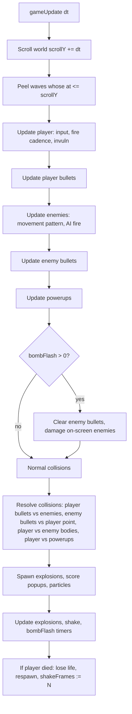

# feat: Vertical-Scrolling Top-Down Shmup (Space Fighter)

## Overview

Replace the template's "Block Dodge" example with a full vertical-scrolling top-down shoot-'em-up in the late-1990s arcade tradition (Raiden, Strikers 1945, DonPachi, Battle Garegga). Pure 2D pixel art on a fixed 384x216 canvas using procedural Canvas drawing and Web Audio procedural sound — zero image or audio assets. The player ship is locked near the bottom, moves left/right, fires and bombs; waves of enemies descend from the top; a tiled terrain scrolls under everything; readable "bullet-hell-lite" patterns threaten a single-pixel player hitbox; power-ups, bombs, lives, score, high score, attract mode, and an optional CRT scanline overlay round out the arcade feel.

## Problem Frame

The repository is a reusable arcade-game template currently shipping with a placeholder "Block Dodge" example. The goal is to turn `space-fighter/` into a real shmup game that fully exercises the template's contract (`gameInit` / `gameUpdate` / `gameRender` / `gameTitleRender` / `gameOverRender`) and feels like an authentic CPS-2 / Neo-Geo era arcade board. This has to work on desktop (keyboard) and mobile (touch buttons generated from `GAME.controls`), stay age-appropriate for a six-year-old (per `CLAUDE.md`), and remain editable as a single-file browser game (no new runtime dependencies, no image/audio files).

## Requirements Trace

- **R1.** Player controls a small fighter locked near the bottom; moves only left/right via arrow keys or A/D; fires with spacebar; bombs with shift. Touch buttons mirror these on mobile.
- **R2.** Vertical auto-scroll over a tiled pixel-art terrain that starts over ocean and transitions into an enemy carrier / island base further into a run.
- **R3.** Enemies spawn from the top in arcade wave patterns: V-formations, sine sweeps, popcorn drifters from the sides, and turrets bolted to the scrolling terrain.
- **R4.** Three enemy types: popcorn fighter (1 HP), gun turret (3 HP, aimed shots), heavy bomber (5 HP, spread bullets on death and periodically).
- **R5.** Enemy bullets are visible, glowing, pink or blue, fired in readable patterns. The player hitbox is a single pixel at ship center.
- **R6.** Power-up drops: red (vulcan spread), blue (laser), gold (score), P (power up), B (extra bomb).
- **R7.** Bombs clear every on-screen enemy bullet, damage all on-screen enemies, and play a white screen flash.
- **R8.** HUD shows score, high score, lives, power level, and bomb count in a chunky arcade style.
- **R9.** Screen flash on bomb, screen shake on player death, large pixel explosions on enemy destruction, muzzle flashes on player fire.
- **R10.** Ship sprites roughly 16x16 to 32x32, hand-pixel-art style, bright saturated palette (deep ocean blue, hot pink bullets, neon green explosions, white muzzle flashes).
- **R11.** Scrolling terrain is procedurally tiled pixel art (water with foam, metal carrier deck, runways).
- **R12.** Optional CRT scanline overlay toggleable with a key.
- **R13.** Title screen with flashing "PRESS START", top-10 high score table, and an attract mode demo loop.
- **R14.** Chunky pixel arcade font for HUD and score popups (monospace bold at arcade-appropriate sizes — no font file dependency).
- **R15.** Versioning bump per `CLAUDE.md`: `GAME.version` starts at `v1` for this project and the first ship commit reads `v1: <message>`.

## Scope Boundaries

- No 3D, no polygons, no sprite images, no audio files. All visuals via `ctx.fillRect` / paths; all sound via `Sound.playTone` / `Sound.playNoise`.
- No edits to `src/engine/*.js` — the template engine is off-limits per `CLAUDE.md`. All game changes live in `src/game-config.js`, `src/game-sounds.js`, and `src/game.js`.
- No new npm dependencies, no external fonts, no network assets beyond the existing Firebase CDN already wired into the template.
- No multiplayer, no save-state, no progression between runs beyond high scores.
- No boss fight in v1 (bomber serves as the "mini-boss" enemy).
- Only one stage/biome transition (ocean → carrier/base). Additional biomes are deferred.

### Deferred to Separate Tasks

- Full multi-stage progression (stage 2, 3, boss): future iteration after v1 feels good.
- Boss fight with patterned attack phases: future iteration.
- Custom bitmap arcade font: future iteration; v1 uses `bold <size>px monospace` which renders "chunky" on the 384x216 pixel-art canvas.
- Gamepad support beyond the template's existing keyboard/touch inputs: future iteration.

## Context & Research

### Relevant Code and Patterns

- `src/game-config.js` — edit `GAME.title`, `GAME.subtitle`, `GAME.version`, `GAME.bgColor`, `GAME.localStoragePrefix`, and the `controls` / `instructions` arrays. Controls listed here drive both keyboard bindings and the auto-generated touch button row (`src/engine/input.js`).
- `src/game-sounds.js` — `SOUNDS` object. `start` and `gameOver` are invoked automatically by the engine; the rest are addressed via `Sound.play(name)` / `Engine.Sound.play(name)`.
- `src/game.js` — entire file is replaced. Must export three globals: `gameInit()`, `gameUpdate(dt)`, `gameRender(ctx, w, h)`; optionally `gameTitleRender(ctx, w, h, time)` and `gameOverRender(ctx, w, h)`.
- `src/engine/loop.js` — call order matters for HUD layering: `gameRender` → `drawParticles` → `drawScorePopups` → `drawUI` (engine's default score+hearts) → `drawGameOverScreen`. Anything we draw in `gameRender` sits **under** the engine's `drawUI` overlay; we cannot replace it, so we work alongside it.
- `src/engine/screens.js::drawUI` — renders `SCORE: NNNNNN` top-left and `maxHealth` hearts top-right, using `Engine.state.score`, `Engine.state.health`, `Engine.state.maxHealth`. We reuse this: `health` = lives, `maxHealth` = max lives. Extra HUD (high score, power level, bomb count) is drawn by the game in `gameRender` in areas the engine HUD does not touch (top-center and bottom edges).
- `src/engine/particles.js` and `Engine.spawnParticle(x,y,vx,vy,size,color,life)` — used for explosion debris and muzzle sparks.
- `Engine.showScorePopup(x,y,text,color)` — floating score text for pickups and kills.
- `src/engine/highscores.js` — `HighScores.scores` is the sorted top-10 array available to the game for rendering the title-screen leaderboard. `HighScores.check(score)` is already called by the engine's game-over handling.
- `src/engine/input.js` — the template already registers every control ID in `Engine.input`. Adding a `fire` and `bomb` control in `GAME.controls` automatically gives us `Engine.input.fire` and `Engine.input.bomb`. Spacebar and Shift must be listed as `Space` / `ShiftLeft` / `ShiftRight`.
- `CLAUDE.md` — template versioning rule: bump `GAME.version` before each push and start commit messages with the new version (e.g., `v2: Add turret AI`).

### Institutional Learnings

- `docs/solutions/` does not exist in this repo — no prior learnings to apply.
- `README.md` notes: "Keep the 384x216 resolution"; "Use procedural graphics"; "Use `dt` for all movement"; "Test on mobile". All apply here.

### External References

- External research skipped. The design space is self-contained (single-file canvas game), the template patterns are clear from the repo itself, and no unfamiliar framework/library is being introduced. Arcade shmup conventions (V-formations, sine sweeps, aimed shots, power levels, bomb clears) are common knowledge and do not need reference docs.

## Key Technical Decisions

- **Do not edit the engine.** All work stays in `src/game-config.js`, `src/game-sounds.js`, and `src/game.js`, per the template contract. Any HUD or title-screen behavior the engine already provides is either reused (score, hearts-as-lives, high-score storage, particle system, score popups) or drawn alongside (power meter, bomb count, high score display, CRT overlay, screen flash, screen shake).
- **Lives via `Engine.state.health`.** Map `health` = remaining lives, `maxHealth` = 3 at game start. The engine's default heart HUD works as a life counter. Each death decrements `health` and triggers a brief respawn invulnerability; reaching 0 triggers the engine's game-over path automatically.
- **Single-pixel player hitbox.** The player ship sprite may be ~20x20, but collision uses only one point — `player.hitboxX`, `player.hitboxY` — which lives at ship center. Bullet→player tests become point-in-rect (or point-in-circle for round bullets). This is canonical bullet-hell-lite behavior.
- **Fixed-step entity arrays, no pooling.** Keep entities as plain arrays (`enemies`, `enemyBullets`, `playerBullets`, `powerups`, `explosions`) and use `splice` on death. Simpler than pools; 384x216 budget is small enough that GC pressure is not a real risk. If profiling ever shows otherwise, pool later.
- **Scrolling world coordinate.** A single monotonically increasing `scrollY` drives the terrain, enemy spawn schedule, and biome transitions. Enemies and bullets live in **screen space** (not world space) because the camera is fixed and everything scrolls past the player — this is how most shmups actually work and keeps math simple.
- **Data-driven enemy spawn schedule.** The spawn timeline is a list of wave descriptors keyed to `scrollY` thresholds: `{ at: 300, type: 'vFormation', enemy: 'popcorn', count: 5, speed: 1.8 }`. The update loop peels off waves whose threshold is reached. The list loops back to the start once the final wave has spawned, so runs are effectively endless with increasing difficulty.
- **Difficulty ramp via loop count.** Each time the spawn schedule loops, global multipliers bump: `enemyHp *= 1.1`, `enemyBulletSpeed *= 1.08`, `spawnDensity *= 1.15`. No explicit "stages" — difficulty is smooth and runs never end until you die.
- **Power levels 1–5, two weapon types.** `player.weapon ∈ {'vulcan','laser'}`, `player.power ∈ [1,5]`. Red power-up sets `weapon='vulcan'` (and +1 power if already vulcan). Blue sets `weapon='laser'` (and +1 power if already laser). `P` pickup increments `power` regardless of weapon. Vulcan fires a spread that widens with power; laser fires fast parallel beams that thicken with power.
- **Bomb is a single state flag with a lifetime.** `bombFlash` starts at a value (e.g., 30 frames) and decrements. While `> 15` the screen is painted white over the world; while `> 0` bullets are cleared and all on-screen enemies take damage each frame. Simple and visually correct.
- **Screen shake via `ctx.save()` + `translate(dx, dy)`** at the start of `gameRender`, matched by `ctx.restore()` at the end. Shake magnitude decays over ~20 frames after a player death. Note that engine HUD (`drawUI`) runs **after** `gameRender` and outside our save/restore, so the HUD remains stable while the world shakes — which is what we want.
- **CRT scanline overlay** is a thin horizontal-line pattern painted on top of everything at the end of `gameRender`. A module-level `crtOn` flag is toggled by a direct `window.addEventListener('keydown', ...)` call inside `gameInit` (not a `GAME.controls` entry, because controls are held-state and we need an edge-triggered toggle). `C` is the toggle key.
- **Attract mode via a sandboxed demo world.** `gameTitleRender` runs every frame on the title screen while `gameUpdate` does not. We keep a small parallel state (`demoPlayer`, `demoEnemies`, `demoBullets`) that `gameTitleRender` ticks forward using a time delta derived from the `time` argument. When the demo ends or a fixed interval elapses, it resets. This gives an attract loop without requiring engine changes.
- **Chunky font = `bold <size>px monospace`.** No external font. Sizes picked per HUD element (e.g., `bold 12px monospace` for score, `bold 8px monospace` for power label, `bold 18px monospace` for title). The canvas already uses `image-rendering: pixelated` (see `src/template.html`), so monospace at bold arcade sizes reads as chunky.
- **`Engine.state.health` goes to 0 only after lives run out.** Individual hits consume a life, respawn the player with brief invulnerability, and leave `health > 0`. The engine transitions to game-over automatically when `health === 0`.
- **Single-pixel bullet collision for enemies** uses enemy axis-aligned bounding boxes; player bullets are small rects (vulcan) or thin rects (laser) and use box overlap against enemy AABBs.

## Open Questions

### Resolved During Planning

- **Q: Should the HUD replace the engine's default score/hearts, or augment it?** A: Augment. The engine HUD is layered on top and cannot be suppressed without editing `screens.js`, which `CLAUDE.md` forbids. Score and lives come from the engine HUD; high score, power level, and bomb count are drawn in `gameRender` in non-overlapping regions (top-center and bottom).
- **Q: Single-pixel hitbox vs. small circle hitbox?** A: Literally a point. A circle adds radius math and is not meaningfully fairer at 384x216. The point sits 2px above ship center.
- **Q: World coordinates or screen coordinates for enemies?** A: Screen coordinates. The camera is fixed, everything scrolls past, and spawn events are driven by a global `scrollY` counter — cleaner than maintaining a virtual world.
- **Q: CRT toggle as a declared control or a direct keydown listener?** A: Direct listener. Declared controls are held-state (good for move/fire), not edge-triggered (needed for a toggle). Same applies if we later add a mute toggle. Document this in code.
- **Q: How do we honor "chunky pixel arcade font" without adding a font file?** A: `bold <size>px monospace` on the pixelated canvas is enough. A hand-drawn bitmap font is deferred.
- **Q: Where does attract mode live?** A: Inside `gameTitleRender` with a parallel demo state, advanced by elapsed time. The engine runs the title-screen render loop every frame even though `gameUpdate` does not fire, so this works without engine changes.

### Deferred to Implementation

- **Exact enemy speeds, bullet speeds, spawn densities, and difficulty curve numbers.** Tunable constants at the top of `game.js` — fill in during playtest, not in this plan.
- **Exact power-level-to-weapon-pattern mapping.** Specific spreads and laser widths will be tuned live until each level feels distinct.
- **Exact wave schedule content.** The *data shape* of wave descriptors is decided; the specific list of waves is content that gets iterated during playtesting.
- **Exact HUD layout pixel positions.** Will be nudged until the HUD reads clearly without colliding with the engine HUD.
- **CRT overlay opacity and scanline density.** Playtest to find a setting that reads "retro" without crushing visibility.

## High-Level Technical Design

> *This illustrates the intended approach and is directional guidance for review, not implementation specification. The implementing agent should treat it as context, not code to reproduce.*

### Module layout inside `src/game.js` (top to bottom)

    Constants and palette
    ├── CANVAS / PLAYER / BULLET / ENEMY speeds, sizes, colors
    └── WAVE_SCHEDULE (data-driven spawn timeline)

    Module state
    ├── player, playerBullets, enemies, enemyBullets, powerups, explosions
    ├── scrollY, nextWaveIndex, difficultyLoop
    ├── bombFlash, shakeFrames, crtOn
    └── demoState  // for attract mode

    Lifecycle hooks
    ├── gameInit()           // reset state, attach CRT keydown
    ├── gameUpdate(dt)       // player → bullets → enemies → powerups → bomb → collisions → cleanup → waves → bg scroll
    ├── gameRender(ctx,w,h)  // shake → terrain → powerups → enemies → player → bullets → explosions → HUD extras → bomb flash → CRT overlay → restore
    ├── gameTitleRender()    // starfield/waves + demo world + title + PRESS START + high score table
    └── gameOverRender()     // draw last frame of the world frozen

    Systems (top-level functions in game.js)
    ├── updatePlayer / renderPlayer / firePlayerWeapon
    ├── spawnWave / updateEnemy<Type> / renderEnemy<Type>
    ├── enemyFire<Pattern>    // aimed, spread, sweep
    ├── updateBullets / collideBullets
    ├── spawnExplosion / updateExplosion / renderExplosion
    ├── spawnPowerup / applyPowerup
    ├── triggerBomb / renderBombFlash
    ├── drawTerrainTile / scrollTerrain
    └── drawExtraHUD / drawCRT

### Frame update pipeline



### Enemy wave data shape

```
WAVE_SCHEDULE = [
  { at: 120,  kind: 'popcornStream', side: 'left',  count: 6, speed: 2.0 },
  { at: 260,  kind: 'vFormation',    enemy: 'popcorn', count: 5, angle: 'down' },
  { at: 520,  kind: 'sineSweep',     enemy: 'popcorn', count: 8, amp: 60 },
  { at: 800,  kind: 'turretOnTerrain', count: 2, offsets: [...] },
  { at: 1200, kind: 'bomber',        count: 1 },
  ...
]
```

Wave descriptors are plain objects; `spawnWave` dispatches on `kind`. Adding a new pattern = adding a `kind` handler and one line to the schedule.

## Implementation Units

- [ ] **Unit 1: Game config, controls, sounds, and shared constants**

**Goal:** Rebrand the project as "SPACE FIGHTER", wire up all required inputs (left/right/fire/bomb), define the shmup sound palette, and establish the module-level constants block at the top of `game.js`.

**Requirements:** R1, R10, R14, R15

**Dependencies:** None.

**Files:**
- Modify: `src/game-config.js`
- Modify: `src/game-sounds.js`
- Modify: `src/game.js` (replace header + constants only; rest of old Block Dodge file is removed in Unit 2)

**Approach:**
- In `game-config.js`, set `title: 'SPACE FIGHTER'`, a subtitle along the lines of `'DEFEND THE SKIES'`, `version: 'v1'`, `bgColor` to a deep arcade blue/black (e.g., `'#050a1a'`), update `localStoragePrefix` to `'spaceFighter'`.
- Expand `controls` to include `left` (ArrowLeft / KeyA), `right` (ArrowRight / KeyD), `fire` (Space), `bomb` (ShiftLeft / ShiftRight). Update `instructions` to match (MOVE / FIRE / BOMB).
- In `game-sounds.js`, define procedural sounds for: `start`, `gameOver`, `shoot` (short high square zap), `laser` (continuous sine chirp), `enemyShoot` (softer saw blip), `hit` (noise burst), `explode` (low noise + descending saw), `bigExplode` (longer, fatter), `powerup` (ascending triad), `bomb` (huge noise + falling sweep), `menuBlip`, `extend` (extra life chime).
- In `game.js`, replace the Block Dodge header comment. Add a palette constants block (`COLOR_OCEAN_1/2`, `COLOR_FOAM`, `COLOR_PLAYER`, `COLOR_PLAYER_JET`, `COLOR_BULLET_PINK`, `COLOR_BULLET_BLUE`, `COLOR_EXPLODE_GREEN`, `COLOR_MUZZLE`, etc.). Add gameplay constants (`PLAYER_SPEED`, `PLAYER_FIRE_COOLDOWN`, `PLAYER_HITBOX_OFFSET_Y`, `BULLET_SPEED`, `ENEMY_BULLET_SPEED`, `POWERUP_SPEED`, `SHAKE_DECAY`, `BOMB_FRAMES`, etc. — values chosen for feel in Unit 11 playtest).
- Keep the Firebase config empty as it currently is so local high scores continue to work.

**Patterns to follow:**
- `src/game-config.js` existing shape.
- Existing sound definitions in `src/game-sounds.js` (use `S.playTone` and `S.playNoise` helpers, optionally chained with `setTimeout` for multi-note effects).

**Test scenarios:**
- Happy path: After Unit 1, run `node build.js` and open `dist/index.html`. The page shows a title screen that reads "SPACE FIGHTER" instead of "BLOCK DODGE", the background is dark blue, `v1` is shown at the bottom, and the browser console is clean.
- Happy path: On a touch device (or DevTools touch mode) the auto-generated button row shows four buttons: LEFT, RIGHT, FIRE, BOMB.
- Happy path: Holding each key (arrow/A/D/Space/Shift) updates `Engine.input.left/right/fire/bomb` — verifiable via `console.log(Engine.input)` in the console during play.
- Edge case: Pressing `ShiftLeft` and `ShiftRight` both set `Engine.input.bomb` true; releasing either keeps it held while the other is down.
- Integration: Calling `Engine.Sound.play('shoot')` etc. in the console plays each sound without error.

**Verification:**
- Title screen reads SPACE FIGHTER v1, controls work, every named sound plays cleanly.

---

- [ ] **Unit 2: Scrolling tiled terrain (ocean → carrier/base)**

**Goal:** Implement the always-scrolling background — procedurally tiled ocean with animated foam, transitioning into a metal carrier deck / island base further into a run. Terrain is drawn first each frame and has no gameplay collision.

**Requirements:** R2, R10, R11

**Dependencies:** Unit 1 (constants / palette).

**Files:**
- Modify: `src/game.js`

**Approach:**
- Introduce `scrollY` (starts at 0, increments by `SCROLL_SPEED * dt` each frame in `gameUpdate`).
- Tile size around 16x16. Compute a tile grid for the visible area plus one row of overscan, offset by `scrollY % TILE_SIZE`.
- For each tile, pick the biome based on which band the tile's **world y** falls into. Bands: ocean → coastline foam stripe → carrier deck → runway stripes → back to ocean (loops with a long period so runs feel varied but endless).
- Ocean tile: two-tone blue with a procedurally placed foam cap determined by `(tileX, tileWorldY) → pseudo-random`. Foam animates by shifting one pixel sideways every few frames.
- Carrier deck tile: dark metal base with rivets (2-pixel highlight dots at fixed positions), accent stripe variants for "runway" rows.
- Transition strip: a few rows of lighter water / foam / shore to sell the shift.
- Drawn at the very start of `gameRender` (after `ctx.save()` + shake translate) so every entity layers cleanly on top.

**Patterns to follow:**
- Block Dodge ground rendering (`gameRender` in the old `game.js`) for the "just draw tiles with `fillRect`" pattern.
- README guidance on using `dt` for movement.

**Test scenarios:**
- Happy path: Background scrolls smoothly top-to-bottom at 60fps; no seams or jitter at tile boundaries.
- Happy path: Runs long enough to cross the ocean→carrier→ocean boundary at least twice; transitions read clearly.
- Edge case: `dt` spikes (tab refocus) — the terrain clamp in `loop.js` (`Math.min(... , 3)`) prevents runaway scroll; verify no visual artifacts after tab switch.
- Edge case: On tall phone screens (canvas scaled up) there are no black bars or unrendered tiles at the edges.

**Verification:**
- Terrain scrolls at 60fps, biomes transition visibly, no per-tile flicker.

---

- [ ] **Unit 3: Player ship — movement, rendering, weapons, bombs**

**Goal:** Implement the player fighter: left/right movement locked to a fixed Y, procedural ship sprite, fire/cooldown, vulcan and laser weapon modes keyed off `player.weapon` and `player.power`, bomb trigger on input edge, and a single-pixel hitbox for incoming bullets.

**Requirements:** R1, R5, R6, R7, R9, R10

**Dependencies:** Unit 1, Unit 2.

**Files:**
- Modify: `src/game.js`

**Approach:**
- `player = { x, y, w, h, hitboxX, hitboxY, weapon: 'vulcan', power: 1, invuln: 0, fireCooldown: 0, bombPressedLast: false }`.
- `y` is fixed (e.g., `GAME.height - 40`); `x` moves with `Engine.input.left/right * PLAYER_SPEED * dt`, clamped to screen.
- Sprite ~20x24, drawn with a handful of `fillRect` calls: hot pink/white fuselage, red cockpit dot, gray wing tips, cyan jet exhaust plume animated by `scrollY` phase for thrust flicker.
- Hitbox: `hitboxX = player.x`, `hitboxY = player.y - PLAYER_HITBOX_OFFSET_Y` (near the cockpit, not the wingtips).
- `fireCooldown` decays each frame; while `Engine.input.fire` and cooldown ≤ 0, spawn bullets per weapon:
  - Vulcan: N parallel small pink bullets with widening spread as power increases (1 straight → 2 → 3 → 5 → 5+angled).
  - Laser: thin vertical rectangles with fast upward velocity, extra beams at higher power; plays `laser` sound at reduced cadence.
  - Each shot spawns a white muzzle flash particle pair via `Engine.spawnParticle`.
- Bomb: triggered on the **rising edge** of `Engine.input.bomb` (use `bombPressedLast` latch), only if `bombCount > 0`. Decrement `bombCount`, set `bombFlash = BOMB_FRAMES`, call `Sound.play('bomb')`. Actual clear-all logic lives in Unit 7.
- `invuln > 0` draws the ship blinking (mirror the Block Dodge blink pattern).

**Execution note:** None — feature-bearing but well-patterned. Normal forward implementation is fine.

**Patterns to follow:**
- Block Dodge player drawing pattern in the old `gameRender`.
- Block Dodge invulnerability blink (skip-draw every N frames).
- `Engine.spawnParticle` for muzzle flashes.

**Test scenarios:**
- Happy path: Left/right keys move the ship smoothly without overshooting the screen edges.
- Happy path: Holding fire produces a visible stream of bullets whose cadence matches `PLAYER_FIRE_COOLDOWN`; muzzle flashes flicker at the nose.
- Happy path: `player.power` can be forced in the console (temporarily) — vulcan at power 1, 3, and 5 visibly widens its spread; laser at power 1, 3, 5 visibly adds parallel beams.
- Edge case: Pressing fire with an empty `Engine.input.fire` (touch button released mid-frame) does not emit an extra bullet.
- Edge case: Bomb input held does not trigger multiple bombs — only the rising edge consumes one bomb.
- Edge case: Running out of bombs (`bombCount === 0`) and pressing bomb does nothing (silent, no flash).
- Integration: Invulnerability frame after a life lost prevents the hitbox from registering enemy bullet hits for its duration.

**Verification:**
- Ship moves, fires both weapons correctly at every power level, bomb fires once per press and only when available, invuln blink works.

---

- [ ] **Unit 4: Enemy types, movement patterns, and wave spawner**

**Goal:** Implement the three enemy types (popcorn fighter, gun turret, heavy bomber) with per-type movement, HP, and draw routines, plus the data-driven wave scheduler that reads `WAVE_SCHEDULE` and spawns formations as `scrollY` crosses each wave's threshold. This unit covers movement and spawning only — enemy firing is Unit 5.

**Requirements:** R3, R4, R10

**Dependencies:** Unit 2, Unit 3.

**Files:**
- Modify: `src/game.js`

**Approach:**
- `enemies = []` with entries `{ type, x, y, hp, age, pattern, patternState, fireCooldown, anchorX, anchorY }`.
- `popcorn`: ~16x16 sprite, 1 HP. Patterns: straight-down, left-to-right drift (`popcornStream`), sine sweep (amplitude from wave descriptor).
- `turret`: ~24x24 sprite, 3 HP, *bolted to scrolling terrain* — its `y` increases with `scrollY` so it scrolls past like terrain; destroyed if off the bottom of the screen.
- `bomber`: ~32x32 sprite, 5 HP, slow straight-down drift, larger hitbox; plays `explode` loop on death.
- `spawnWave(waveDescriptor)` dispatches on `kind`:
  - `popcornStream` — schedules N popcorn enemies over a short interval, entering from one side.
  - `vFormation` — spawns N popcorn enemies in a V centered on `GAME.width / 2`, all moving down together.
  - `sineSweep` — spawns N popcorn enemies whose `pattern = 'sine'` with given amplitude and phase offsets.
  - `turretOnTerrain` — spawns 1–N turrets anchored to the current `scrollY` at given x offsets.
  - `bomber` — spawns one bomber.
- `updateWaves(dt)`: while `nextWaveIndex < WAVE_SCHEDULE.length && scrollY >= WAVE_SCHEDULE[nextWaveIndex].at`, spawn and increment. When the end is reached, bump `difficultyLoop`, apply multipliers, reset `nextWaveIndex` to 0, rebase `at` thresholds against current `scrollY`.
- Enemies that exit the screen bottom are culled.
- Render order (back to front): popcorn, turret, bomber. All drawn with short `fillRect` sequences using the palette constants.

**Patterns to follow:**
- Block Dodge spawn rate + per-frame entity update loops for the data-driven cadence.
- Array `splice`-on-cull pattern for cleanup.

**Test scenarios:**
- Happy path: Each wave descriptor kind spawns the expected shape: a V of 5 popcorns visibly arrives; a sine sweep of 8 popcorns oscillates; a turret appears welded to the scrolling deck; a bomber crawls down the middle.
- Happy path: With `console.log(enemies.length)` mid-play, no uncontrolled accumulation — the list grows and shrinks as enemies enter and exit.
- Edge case: `dt` spike does not spawn a wave twice.
- Edge case: At the end of the schedule, a new loop starts; a second run through the schedule shows tougher feel (faster / more enemies) without visual glitches.
- Edge case: Turret leaving the bottom of the screen is culled and does not re-enter.
- Integration: Spawned enemies are hit-testable against player bullets from Unit 3 (placeholder: hit reduces HP, kill removes from list — scored in Unit 6).

**Verification:**
- All wave kinds spawn correctly, enemies move along their patterns, and the schedule loops with increased difficulty.

---

- [ ] **Unit 5: Enemy firing — aimed shots, spreads, pink/blue bullets, single-pixel hitbox collision**

**Goal:** Give each enemy type its firing behavior and implement enemy-bullet → player-point collision, resolving the player's hitbox as a single pixel at ship center. Bullets are clearly readable pink (turret) and blue (bomber); popcorn occasionally fires single aimed shots.

**Requirements:** R4, R5, R9, R10

**Dependencies:** Unit 3 (player hitbox), Unit 4 (enemies).

**Files:**
- Modify: `src/game.js`

**Approach:**
- `enemyBullets = []` entries `{ x, y, vx, vy, r, color, glowColor }`.
- Turret fires *aimed* shots at the player every `TURRET_FIRE_COOLDOWN` frames while on-screen: compute normalized direction from turret to `player.hitboxX/Y`, scale by `ENEMY_BULLET_SPEED`, spawn as pink.
- Bomber fires a blue 5-way spread every `BOMBER_FIRE_COOLDOWN` frames and another spread on death; also drops a stream of blue bullets at cooldowns scaled by difficulty loop.
- Popcorn occasionally fires one aimed pink bullet (low probability per frame); most remain passive so the screen stays readable.
- Enemy bullets render as a filled colored circle plus a larger lower-alpha "glow" ring for the CPS-2 look (two `ctx.arc` / `ctx.fillRect` passes).
- Update each enemy bullet with `x += vx*dt; y += vy*dt`; cull off-screen.
- Collision: if `player.invuln <= 0` and `bombFlash === 0`, test each enemy bullet against `(player.hitboxX, player.hitboxY)` via point-in-circle with radius `bulletRadius + 1`. On hit, trigger player death sequence: `bombCount`-independent, decrement lives, respawn with invuln, start `shakeFrames`, spawn a big explosion particle burst.
- Player-vs-enemy-body collision also uses the single pixel against each enemy's AABB.

**Patterns to follow:**
- Block Dodge's `boxOverlap` helper as a starting point; keep it for rect-rect checks and add a small `pointInCircle` helper.
- Block Dodge's "hit → invincibility + particle burst" flow.

**Test scenarios:**
- Happy path: A turret on-screen fires a line of pink bullets each aimed at the current player position; dodging left makes subsequent bullets lead left.
- Happy path: A bomber fires a blue 5-way spread; the arcs are visible and evenly spaced.
- Happy path: A popcorn enemy occasionally fires a lone pink shot.
- Edge case: A bullet grazing the wingtip (outside the 1-pixel hitbox) does **not** kill the player.
- Edge case: A bullet arriving during `player.invuln > 0` does not kill the player.
- Edge case: A bullet arriving while `bombFlash > 0` is cleared and does not kill the player.
- Error path: An enemy destroyed mid-fire does not emit a bullet after its destruction frame.
- Integration: Dying reduces `Engine.state.health` by 1, triggers `shakeFrames`, plays `explode`, and respawns with a visible invuln blink.

**Verification:**
- Bullet patterns read clearly on 384x216, single-pixel hitbox matches arcade expectations, all edge cases behave.

---

- [ ] **Unit 6: Player bullets vs enemies, explosions, score, and scoring popups**

**Goal:** Resolve player-bullet-vs-enemy collisions, deal damage, spawn pixel explosions on kills, award score, and show floating score popups. This unit makes the combat loop feel satisfying.

**Requirements:** R4, R8, R9, R10

**Dependencies:** Unit 3 (player bullets), Unit 4 (enemies).

**Files:**
- Modify: `src/game.js`

**Approach:**
- Each player bullet carries its damage (vulcan = 1, laser = 2 at base; scales mildly with power). On each frame iterate player bullets × enemies: if AABB overlap, decrement enemy HP, remove bullet, add a small spark via `Engine.spawnParticle`.
- On enemy HP ≤ 0, remove enemy, increment `Engine.state.score` by per-type value (popcorn 50, turret 200, bomber 1000 × difficulty loop), spawn `explosion` entries:
  - `explosion = { x, y, age, maxAge, radius, kind }` — draw as expanding neon-green ring + white core + debris particles.
  - Large enemies (bomber) get a `bigExplode` sound and a larger radius.
- Call `Engine.showScorePopup(x, y, '+' + value, color)` at the kill site.
- Gold power-up pickup awards flat bonus via the same popup path (Unit 7).
- Award an extra life when score crosses `EXTEND_THRESHOLD` (classic 1UP); play `extend` sound, increment `Engine.state.health` if below some cap.

**Patterns to follow:**
- Block Dodge's particle burst on hit as a baseline for pixel debris.
- `Engine.showScorePopup` signature — reuse as-is.

**Test scenarios:**
- Happy path: One vulcan bullet kills a popcorn enemy; three hits kill a turret; five hits kill a bomber.
- Happy path: Each kill shows a floating `+50` / `+200` / `+1000` in the right color and plays the correct sound.
- Happy path: Score in the engine HUD updates to match popups summed over a run.
- Edge case: Two bullets landing on the same frame on a 1-HP enemy only award score once (bullet iteration short-circuits on kill).
- Edge case: A bomber killed while leaving the screen still scores and still spawns its death spread (from Unit 5).
- Edge case: Crossing `EXTEND_THRESHOLD` once gives exactly one extra life; crossing it again at the next threshold multiple gives another.
- Integration: Explosions spawned here are driven by a single `updateExplosion`/`renderExplosion` pair and do not leak particles.

**Verification:**
- Combat loop feels responsive; score totals are correct; explosions read clearly.

---

- [ ] **Unit 7: Power-ups, pickups, and bomb effect**

**Goal:** Implement the five power-up types and their pickup behavior, plus the actual bomb effect (clear all enemy bullets, damage on-screen enemies, white screen flash).

**Requirements:** R6, R7, R9

**Dependencies:** Unit 3 (player state), Unit 5 (enemy bullets), Unit 6 (score / explosions).

**Files:**
- Modify: `src/game.js`

**Approach:**
- Power-up drop rules: popcorn has low chance, turret medium, bomber guaranteed. Type chosen from a weighted table (`P` common, `red`/`blue` uncommon, `gold` rare, `B` rare).
- `powerups = []` entries `{ x, y, vy, kind, age }`. Render as a 16x16 rounded square in the kind's color with a 1-character label: `R`, `B`, `G`, `P`, `B` (bomb). Use color to disambiguate the two `B`s (blue vs yellow).
- Drift down at `POWERUP_SPEED`; cull off-screen. Gentle idle bob via `Math.sin(age)` for arcade feel.
- Collision: circle/point test against player center (generous radius — pickups are easy on purpose). Effects:
  - `red` (vulcan): `player.weapon = 'vulcan'`; if already vulcan, `power = min(power+1, MAX_POWER)`.
  - `blue` (laser): same, for laser.
  - `gold` (score): `+5000`, popup, `powerup` sound.
  - `P`: `power = min(power+1, MAX_POWER)`.
  - `B` (bomb): `bombCount = min(bombCount+1, MAX_BOMBS)`.
- Bomb effect (invoked from Unit 3's bomb trigger): while `bombFlash > 0`, `enemyBullets.length = 0` and each on-screen enemy takes a small amount of damage per frame (turrets/bombers get chunked, popcorn dies). While `bombFlash > BOMB_FLASH_CUTOFF`, paint the whole screen white at decreasing alpha in `gameRender` after everything else.
- Bomb also grants player brief invulnerability for the duration of the flash.

**Patterns to follow:**
- `Engine.showScorePopup` for gold pickups and bomb/extra-life events.
- Particle bursts on pickup for juice.

**Test scenarios:**
- Happy path: Every pickup type changes player state correctly (verify in console: `player.weapon`, `player.power`, `bombCount`).
- Happy path: Red pickup as a vulcan player raises power; red pickup as a laser player switches to vulcan at power 1 (do not carry laser power to vulcan).
- Happy path: Bomb clears every on-screen enemy bullet the frame it fires and destroys all popcorn enemies visible.
- Happy path: A white screen flash covers the canvas during the opening frames of a bomb, fading out cleanly.
- Edge case: Picking up two red power-ups at max power does not over-increment `power`.
- Edge case: Picking up `B` bomb at max bombs does not over-increment.
- Edge case: A bomber dropped bomb/power-up must not spawn an infinite chain of follow-up pickups on death.
- Integration: Bomb firing plus a turret on-screen takes chunks off turret HP each frame for the bomb duration.

**Verification:**
- All pickups work, weapon/power/bomb state never goes out of range, bomb feels powerful.

---

- [ ] **Unit 8: Player death flow, screen shake, lives, and respawn**

**Goal:** Wire up the full player-death sequence: explosion, `Sound.play('bigExplode')`, decrement `Engine.state.health`, set `shakeFrames`, respawn with invulnerability OR end the game if lives hit zero.

**Requirements:** R8, R9

**Dependencies:** Unit 5 (collision triggers death), Unit 6 (explosions).

**Files:**
- Modify: `src/game.js`

**Approach:**
- Introduce `killPlayer()` helper called from the single-pixel collision check in Unit 5 and from player-vs-enemy-body collision.
- `killPlayer` spawns a large explosion at the ship's position, plays `bigExplode`, sets `shakeFrames = SHAKE_FRAMES`, decrements `Engine.state.health` by 1.
- If `Engine.state.health > 0`, respawn player at starting position, set `player.invuln = RESPAWN_INVULN`, drop `player.power` down by 1 (classic shmup penalty), keep `weapon`, clear any in-flight player bullets so the next life starts fresh.
- If `Engine.state.health <= 0`, leave `health = 0` — the engine (`loop.js`) picks up game-over on its next frame. Do not manually toggle `Engine.state.gameOver`.
- `shakeFrames` decays by `SHAKE_DECAY` per frame in `gameUpdate`. In `gameRender`, at the top (inside `ctx.save()`), translate by `(random * shake, random * shake)` where `shake = shakeFrames / N`.

**Patterns to follow:**
- Block Dodge's `invincible` countdown.
- Engine game-over handoff in `src/engine/loop.js` — let the engine drive it.

**Test scenarios:**
- Happy path: Taking a hit kills the player, the screen shakes for ~20 frames, a life is lost, the ship respawns invincibly, and play continues.
- Happy path: Dying with 1 life remaining ends the run — the engine's GAME OVER screen appears.
- Edge case: Power drop on death never goes below 1.
- Edge case: Shake does not affect engine HUD (`drawUI` runs after `gameRender`'s `ctx.restore`).
- Edge case: Bullets spawned the frame of death do not continue travelling after respawn.
- Integration: Death reached via bullet and via enemy body both use the same `killPlayer` path.

**Verification:**
- Death sequence is visible and non-glitchy; game-over handoff works without engine edits.

---

- [ ] **Unit 9: HUD extras, bomb flash overlay, CRT scanline toggle, versioning bump**

**Goal:** Draw the extra HUD elements (high score, power level, bomb count) in `gameRender` alongside the engine's default HUD, paint the bomb white flash, add the CRT scanline overlay with a `C` keydown toggle, and finalize `GAME.version`.

**Requirements:** R8, R12, R14, R15

**Dependencies:** Unit 7 (bomb flash state), Unit 8 (lives via engine HUD).

**Files:**
- Modify: `src/game.js`
- Modify: `src/game-config.js` (version only)

**Approach:**
- `drawExtraHUD(ctx)` called near the end of `gameRender` (after world, before CRT/flash overlays, after `ctx.restore` so shake does not jiggle the HUD):
  - `HI 000000` top-center using `HighScores.scores[0]?.score ?? 0` in bold gold.
  - `POWER ██░░░` bottom-left: label + 5 tiny bars filled according to `player.power`, colored by `player.weapon`.
  - `BOMB x2` bottom-right.
- Bomb flash: while `bombFlash > BOMB_FLASH_CUTOFF`, paint `rgba(255,255,255, alpha)` over the whole canvas.
- CRT overlay: loop every `CRT_SCANLINE_STEP` rows and `fillRect` a 1px-high dark line at low alpha across the canvas width. Gated by `crtOn` flag (default off).
- In `gameInit`, attach `window.addEventListener('keydown', (e) => { if (e.code === 'KeyC') crtOn = !crtOn; })` **once** (guard with a module-level `crtListenerAttached` flag so `gameInit`'s restart re-invocation does not add duplicate listeners).
- Add `CRT: C` to `GAME.instructions` so desktop players see the toggle hint.
- Bump `GAME.version` to `v1` (already set in Unit 1 — confirm here) and note in code comments that commit message should start with `v1:`.

**Patterns to follow:**
- Engine HUD layering order in `src/engine/loop.js`.
- Block Dodge invincibility blink approach for the bomb flash alpha ramp.

**Test scenarios:**
- Happy path: HUD shows score top-left (engine), hearts top-right (engine), high score top-center (game), power bars bottom-left (game), bomb count bottom-right (game).
- Happy path: Picking up `P` fills an additional power bar; picking up `B` increments bomb count.
- Happy path: Pressing `C` toggles the scanline overlay on and off; the overlay does not visibly drop frame rate.
- Edge case: Multiple `gameInit` calls (restart after game over) do not stack duplicate `keydown` listeners — toggle still requires one press per toggle.
- Edge case: Bomb flash is not affected by screen shake (runs after `ctx.restore`).
- Edge case: `HighScores.scores` empty array still renders `HI 000000` without crashing.

**Verification:**
- Complete HUD reads cleanly, CRT toggle works with no duplicate listeners, bomb flash covers the screen at peak and fades out.

---

- [ ] **Unit 10: Title screen, attract mode, high-score table, game-over art**

**Goal:** Replace the engine's default title/game-over visuals using `gameTitleRender` and `gameOverRender` hooks: flashing "PRESS START", top-10 high score table, attract-mode demo loop, and a frozen final-frame render on game over.

**Requirements:** R13, R14

**Dependencies:** All earlier units — attract mode replays the gameplay functions on a sandboxed state.

**Files:**
- Modify: `src/game.js`

**Approach:**
- `gameTitleRender(ctx, w, h, time)` is called every frame while the title screen is up (see `src/engine/screens.js::drawTitleScreen` — it calls this hook before drawing its own title text).
  - Background: a small parallax ocean scroll using the Unit 2 tile routines so the title feels alive.
  - Attract mode: maintain `demoState = { player, enemies, bullets, t, phase }`. Each frame, advance `demoState` with a scripted sequence (ship flies in, dodges a V-formation, shoots a turret, picks up a power-up, dodges bomber spread). Reset every ~12 seconds. Drawn using the same `renderPlayer/renderEnemy*/renderBullet*` routines as gameplay, so no duplicated art.
  - Flashing PRESS START: modulate alpha with `Math.sin(time * 4)`; use a chunky bold size like `bold 14px monospace`.
  - High score table: read `HighScores.scores` (top 10); render rank, name, score in a column below the title in bold monospace. If fewer than 10 exist, show `---` rows to fill the table.
  - Note that the engine's `drawTitleScreen` still renders `GAME.title`, subtitle, and version on top of our art — that is fine, we complement it rather than fight it.
- `gameOverRender(ctx, w, h)` draws the last game frame frozen in place (terrain, player wreckage, any lingering enemies) so the engine's GAME OVER overlay has visual context. Implementation: just skip calling `gameUpdate`-side systems and reuse the existing world state arrays to re-render.

**Patterns to follow:**
- `src/engine/screens.js::drawTitleScreen` call order — use it to understand when `gameTitleRender` runs and what the engine draws on top.
- `HighScores.scores` shape (array of `{ name, score }`).

**Test scenarios:**
- Happy path: On the title screen, PRESS START pulses, the attract-mode demo plays a short canned sequence, and the top-10 list is visible.
- Happy path: After beating a high score and entering a name, returning to the title screen shows the new name/score in the list.
- Edge case: With zero saved high scores, the table renders 10 placeholder rows without crashing.
- Edge case: Attract mode resets cleanly at its interval and never leaks enemies/bullets into real gameplay state (the `demoState` arrays are separate from live arrays).
- Edge case: On game over, `gameOverRender` shows the frozen world behind the engine's dark overlay — no blank canvas.
- Integration: Pressing any key from the title screen starts a real game (engine behavior) and `demoState` is discarded cleanly.

**Verification:**
- Title screen feels like an arcade attract loop, high score table renders, game-over shows frozen world behind overlay.

---

- [ ] **Unit 11: Playtest tuning, balance pass, and build verification**

**Goal:** Play the built game end-to-end, tune numeric constants for feel, confirm mobile touch controls work, and verify the final `node build.js` output runs cleanly from `dist/index.html`.

**Requirements:** R1–R15 (verification pass)

**Dependencies:** Units 1–10.

**Files:**
- Modify: `src/game.js` (numeric constants only)

**Approach:**
- Run `node build.js` and open `dist/index.html`.
- Play several full runs. Tune, in order: player speed → fire cadence → enemy speeds → enemy bullet speeds → spawn density → score values → extend threshold → difficulty multipliers → shake magnitude → bomb duration → CRT opacity.
- Verify age-appropriateness for a six-year-old: bullet patterns are readable, bombs are powerful, deaths are forgiving-ish.
- Verify mobile (DevTools device mode or a real device): four touch buttons appear and respond; firing+moving simultaneously works; the game remains playable at common phone aspect ratios.
- Run the game in a fresh private window: high scores reset cleanly, then a new high score round-trips through Firebase (if configured) or localStorage.
- Confirm the version on the title screen reads `v1`.

**Execution note:** Playtest is the verification; no new code structure here, only constant tuning.

**Test scenarios:**
- Happy path: Starting a run and dying at least once shows every system cooperating: terrain, waves, firing, power-ups, bombs, HUD, death, game over, high score entry, restart.
- Happy path: CRT toggle with `C` works during a live run.
- Happy path: `dist/index.html` opens in Chrome, Safari, and mobile Chrome without console errors.
- Edge case: A run long enough to loop the difficulty schedule twice remains playable (no runaway speed).
- Edge case: Tab-switching mid-run does not desync anything visually after the tab regains focus.

**Verification:**
- A full run from title → attract loop → play → die → game over → high score → restart works end-to-end on desktop and mobile.

## System-Wide Impact

- **Interaction graph:** `src/game.js` replaces Block Dodge wholesale; `src/game-config.js` gains two new controls and a renamed game; `src/game-sounds.js` gains a shmup sound set. The engine is unchanged. The build script (`build.js`) already concatenates these three files into `dist/index.html` — no changes needed.
- **Error propagation:** All failure modes are local to the game loop (bad state, NaN positions). Defensive validation is avoided — the engine hands the game a clean `dt` already clamped to `3`, and input is always initialized. Browser console should stay silent during play.
- **State lifecycle risks:** Restart path calls `gameInit` again — any module-level arrays (`enemies`, `playerBullets`, etc.) **must** be re-initialized there, not just declared at module load. The CRT `keydown` listener must be guarded with a module-level flag so repeated `gameInit` calls do not stack it. Attract-mode `demoState` must be reset when a real run starts so no demo entities leak into live gameplay.
- **API surface parity:** None. This game is the sole consumer of the template and does not expose an API.
- **Integration coverage:** The single most important cross-layer behavior is "engine's `health === 0 → gameOver` transition fires correctly from game-side damage", which is exercised in Unit 8. The second is "engine's `drawUI` draws on top of our `gameRender`" — verified in Unit 9's HUD layout.
- **Unchanged invariants:** Engine files in `src/engine/*` must not be edited (per `CLAUDE.md`). `gameInit` / `gameUpdate` / `gameRender` remain the only required game contract functions. `gameTitleRender` and `gameOverRender` remain optional hooks. The Firebase high score path is not touched.

## Risks & Dependencies

| Risk | Mitigation |
|------|------------|
| HUD collisions — engine HUD draws on top of `gameRender` and we cannot replace it. | Place game-side HUD (high score, power, bomb) in top-center and bottom edges; keep clear of the engine's top-left score and top-right hearts. Verified in Unit 9. |
| Restart leaks — module-level arrays or listeners not reset on `gameInit`. | Unit 9 explicitly guards the CRT keydown listener; every `let` array is reset at the top of `gameInit`; Unit 11 playtests multi-restart runs. |
| Unreadable bullet patterns at 384x216. | Enemy-bullet glow (inner fill + lower-alpha outer ring), bright palette, and playtest tuning in Unit 11. |
| Performance dip from many entities + particles on a small canvas. | Arrays with `splice` are fine at this scale; cull off-screen aggressively; if FPS drops, cap particle count and trim spawn density. FPS debug overlay is available via `?debug=fps`. |
| Mobile fire button in the wrong spot or unresponsive. | Template generates touch buttons from `GAME.controls` in order — verify order and spacing in Unit 1 and Unit 11. |
| Attract mode calls real gameplay functions — risk of mutating live state. | Separate `demoState` object; never touch module-level `player`/`enemies`/etc. from inside the attract loop. Verified in Unit 10. |
| Browser rate-limiting Web Audio on repeated sounds (`shoot` firing every frame). | Throttle `Sound.play('shoot')` at the player fire cadence, not on every bullet spawn; similarly for `laser`. Tuned in Unit 11. |
| Single-pixel hitbox feels too brutal or too forgiving depending on tuning. | Playtest with a six-year-old tester in mind per `CLAUDE.md`; if needed, inflate the effective hitbox by 1–2 px (still a point test against a slightly larger radius). |

## Documentation / Operational Notes

- Update `GAME.version` from `v1` upward on subsequent pushes; first ship commit message starts with `v1:` per `CLAUDE.md`.
- No changes needed to `README.md` — the template README describes the template, and this game is the template consumer. If the README ever gets a "built with this template" section, add Space Fighter there in a future pass.
- `node build.js` remains the only build command. `dist/index.html` is the artifact.
- Firebase config stays empty unless the user explicitly wires it later; local high scores work without it.

## Sources & References

- Origin document: none — planned directly from the `ce:plan` feature description.
- Related code: `src/game-config.js`, `src/game-sounds.js`, `src/game.js`, `src/engine/engine.js`, `src/engine/loop.js`, `src/engine/screens.js`, `src/engine/input.js`, `src/engine/highscores.js`, `src/template.html`, `build.js`.
- Related PRs/issues: none.
- Repo rules: `CLAUDE.md` (project root and `space-fighter/CLAUDE.md`).
